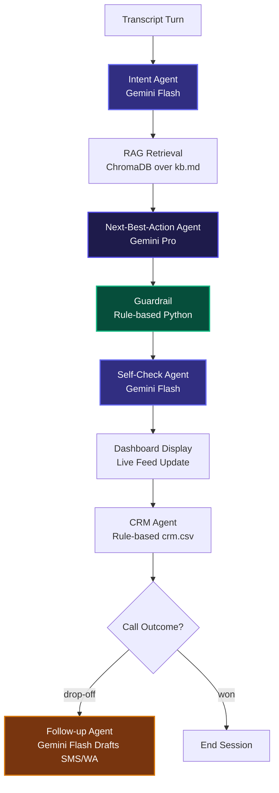

# AI Voice Co-Pilot — Pay-in-3 Zero-Cost EMI (Agent-Assist)

## Problem
In high-velocity fintech telesales, agents must explain complex checkout products like "Pay-in-3 Zero-Cost EMI" under tight compliance guardrails. They often struggle to retrieve exact eligibility criteria, fees, and objections in real-time, leading to missed conversions, compliance violations (like promising approval), and onboarding bottlenecks.

## Solution
Agent-assist AI co-pilot: listens to (simulated) live transcript turns, detects
intent, retrieves grounded KYC/product facts via RAG, suggests a next-best-action
to the human sales agent, checks it against compliance rules and a self-review
pass, then updates CRM and drafts follow-ups on drop-off. The human agent always
makes the final call — the AI only suggests.

## Architecture



## Agent breakdown

| Agent | Model / Tier | Why |
|---|---|---|
| Intent Agent | Gemini Flash | routine classification, cheap |
| Retrieval | Chroma (no LLM) | grounds all facts, prevents hallucination |
| Next-Best-Action | Gemini Pro | high-stakes reasoning step |
| Guardrail | rule-based Python | compliance-critical, must be deterministic |
| Self-Check | Gemini Flash | cheap second pass before output is shown |
| CRM Agent | rule-based Python | deterministic write, no LLM needed |
| Follow-up | Gemini Flash | low-stakes drafting task |

## Guardrails implemented
- **Consent**: first turn of every transcript is a recorded/AI-assisted disclosure line
- **Data Privacy**: `guardrail.mask_pii()` regex-masks phone/PAN/account numbers before CRM write
- **Human Oversight**: AI never outputs approval/final terms — guardrail blocks that language; agent decides
- **Accuracy**: Next-Best-Action agent is only given RAG-retrieved facts, instructed not to invent terms

## Cost tracking
See `outputs/cost_log.csv`, generated automatically by every agent call.
Rough cost-per-call: **₹0.33 INR** (estimated using mixed Gemini 3.5 Flash-lite / 3.5 Flash tokens).

## Setup
```bash
pip install -r requirements.txt
cp .env.example .env   # add your GEMINI_API_KEY
python pipeline.py
```

## What we cut, and why
- **Live Voice Integration (Twilio/WebRTC)**: We bypassed telephony integration to focus on building the core reasoning pipeline, deterministic guardrails, and real-time dashboard visualization.
- **Text-to-Speech (TTS) / Voice output**: Because this is a co-pilot designed to guide a human sales agent, we prioritized visual assistance (recommending responses) to maintain the "human-in-the-loop" model, which prevents latency and conversational friction.
- **Persistent Vector DB Infrastructure**: We used an ephemeral in-memory ChromaDB instance to simplify local developer environment onboarding and testing without managing external cloud database keys.

## Roadmap
- **Whisper/Gemini Audio Integration**: Integrate real-time audio streaming (STT) to dynamically transcribe conversations directly from telephony trunks.
- **Agent Feedback Loop**: Build a "thumbs up/down" interface on recommendations to collect active RLHF datasets for continuous prompt and RAG tuning.
- **Multi-Product RAG Routing**: Expand the knowledge base to support multiple financial checkout schemes, using an Agentic router to fetch merchant-specific policies and terms.
