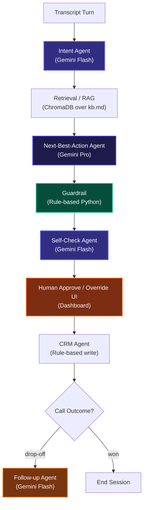

# AI Voice Co-Pilot — Pay-in-3 Zero-Cost EMI

## Problem

Fintech telesales agents onboarding customers onto a Pay-in-3 Zero-Cost EMI product must explain eligibility, KYC requirements, and late-payment terms accurately under live compliance constraints. At scale — hundreds of calls a day — agents miss objections, mis-quote terms, and either over-promise (compliance risk) or under-explain (conversion loss). Manual coaching cannot keep pace with call volume.

## Solution

An agent-assist AI co-pilot that listens to each live transcript turn, detects customer intent, retrieves grounded product facts via RAG (Chroma over `kb.md`), and suggests a next-best-action response to the human agent. Every suggestion passes a rule-based guardrail and a Gemini self-check before appearing on screen. **The human agent always approves or overrides before anything is sent** — the AI never acts autonomously.

## Architecture



## Agent Breakdown

| Agent | Model / Tier | Why |
|---|---|---|
| Intent Agent | Gemini Flash | Routine classification — fast and cheap |
| Retrieval / RAG | ChromaDB (no LLM) | Grounds every suggestion in facts; prevents hallucination |
| Next-Best-Action | Gemini Pro | High-stakes reasoning; accuracy justifies the cost |
| Guardrail | Rule-based Python | Compliance-critical; must be deterministic, not probabilistic |
| Self-Check | Gemini Flash | Cheap second pass before any output reaches the agent |
| CRM Agent | Rule-based Python | Deterministic structured write; no LLM required |
| Follow-up Agent | Gemini Flash | Low-stakes drafting task; speed over depth |

## Guardrails Implemented

- **Consent** — First turn of every transcript is a recorded/AI-assisted disclosure statement, enforced at data generation and validated at ingest.
- **Data Privacy** — `guardrail.mask_pii()` applies regex masks to phone numbers, PAN cards, and account numbers before any CRM write.
- **Human Oversight** — The AI suggestion surface includes **Approve & Send** and **Override & Send** buttons. The AI never sends a message automatically; every action requires an explicit human decision, logged with a timestamp for compliance audit.
- **Accuracy** — The Next-Best-Action agent receives only RAG-retrieved facts from `kb.md` and is explicitly instructed never to invent terms, rates, or eligibility criteria.

## Cost Tracking

All agent calls log to `outputs/cost_log.csv` automatically (timestamp, model tier, token count, INR cost).

**Cost-per-call: ₹[INSERT_YOUR_NUMBER]**

> Calculated as: sum of `approx_cost_inr` across all rows ÷ 30 transcripts.

## What We Cut and Why

| Cut | Reason |
|---|---|
| Real telephony / Twilio integration | Scope — core value is the reasoning pipeline, not the voice transport layer |
| Live STT / TTS | Co-pilot targets visual assistance; avoiding voice output preserves human-in-the-loop clarity |
| Cloud database (Pinecone / Firestore) | In-memory ChromaDB keeps local setup zero-credential; swappable in one config line |
| CI/CD pipeline | Hackathon scope — integration tests cover critical paths instead |

## Roadmap

- **Real call integration** — Connect to a live telephony stream (Twilio / WebRTC) via Whisper or Gemini Audio for real-time STT transcription.
- **Cloud CRM API** — Replace the local `crm.csv` write with a Salesforce / Zoho API call using the CRM Agent output schema as-is.
- **Larger transcript dataset** — Train intent classification on 500+ real anonymised call recordings to improve RAG routing and suggestion quality.

## Setup

```bash
pip install -r requirements.txt
cp .env.example .env        # add your GEMINI_API_KEY
python pipeline.py          # processes transcripts, writes dashboard/live_feed.json
```

Open `dashboard/index.html` via a local server (e.g. `python -m http.server 8000`) at `http://localhost:8000/dashboard/`.
